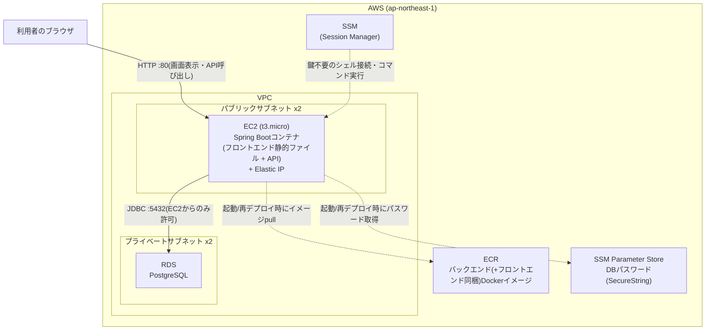

# 03. AWS構成の全体像

このプロジェクトは、一気に全部を構築するのではなく**段階的に**AWS構成を作っていく。

| フェーズ | 内容 | 状態 |
|---|---|---|
| Phase 1 | EC2 1台にフロントエンド(静的ファイル)+バックエンドAPIを同梱したコンテナを立てる | 完了 |
| Phase 2 | RDS(PostgreSQL)を追加し、EC2上のコンテナから接続する(EC2からのみ接続可能) | **今回の対象** |
| Phase 3(検討中) | フロントエンドをS3+CloudFrontに分離する | 未着手・採用するかも含めて検討中 |

このドキュメントはPhase 2時点の構成を説明する。

## 構成図(Phase 2)



Phase 3(検討中)でS3/CloudFrontが図に追加される想定。

## 各リソースの役割

### ネットワーク(`network.tf`, `security_groups.tf`)

- **VPC**: このプロジェクト専用の仮想ネットワーク(`10.0.0.0/16`)
- **パブリックサブネット x2**: 異なるアベイラビリティゾーン(データセンター)に1つずつ配置。バックエンドを動かすEC2インスタンスを置く。インターネットゲートウェイ経由で外部と直接通信できる
- **プライベートサブネット x2**: RDSを置く。外部からの直接アクセス経路を持たない
- **セキュリティグループ**: 通信を許可する範囲を絞るファイアウォール。「EC2は誰からでも80番ポートを受ける」「RDSはEC2からだけ5432番ポートを受ける」という2段構えで、必要最小限の通信だけを許可している

コスト削減のため**NATゲートウェイは作らない**。通常はプライベートサブネットのリソースが外部と通信するためにNATゲートウェイ(月額$30程度〜)が必要だが、RDSは自発的に外部と通信しないため不要。

### バックエンド実行基盤(`ecr.tf`, `ec2.tf`)

- **ECR**: `backend/Dockerfile` からビルドしたコンテナイメージを保管するプライベートなDockerレジストリ。このイメージには、`app/`(React)をビルドした静的ファイルも `src/main/resources/static/` として同梱されている(Spring Bootが自動的に配信する)
- **EC2(t3.micro)**: フロントエンド画面+バックエンドAPIを1つのコンテナとして動かす1台のインスタンス。ALBやECSのようなマネージドな実行基盤は使わず、起動時にEC2自身がECRからイメージをpullしてDockerコンテナとして起動する(`terraform/templates/deploy-backend.sh.tpl`)。t3.microはAWSの無料利用枠の対象になりうるインスタンスタイプ
- **Elastic IP**: EC2に紐づく固定のパブリックIPアドレス。インスタンスを再起動してもIPアドレスが変わらない
- **SSM(Systems Manager) Session Manager**: SSHキーを使わずにEC2へシェル接続・コマンド実行できる仕組み。ポート22を一切開けていないため、鍵の管理や紛失のリスクがない

> 元々はALB + ECS Fargateの構成も検討したが、**どちらも無料利用枠の対象外**(常時起動で合計月$25〜30程度)なため、無料利用枠の対象になりうるEC2単一インスタンス構成にした。詳細は[05-teardown-and-cost.md](05-teardown-and-cost.md)。

### データベース(`rds.tf`)

- **RDS(PostgreSQL)**: マネージドなPostgreSQL。バックアップ・パッチ適用などをAWSが代行する。セキュリティグループにより**EC2からの接続のみ許可**し、`publicly_accessible = false`でインターネットから直接到達できないようにしている
- **SSM Parameter Store**: Terraformが自動生成したDBパスワードを`SecureString`(暗号化)として保管する。EC2はこのパラメータ名を起動スクリプトから参照し、起動時にIAMロールの権限で復号・取得する(コードやtfvarsに平文で書かない)。Secrets Managerと違い固定費がかからない

### フロントエンドとバックエンドの同居について

個人・学習用途で認証もなく利用者もEC2 1台で十分なため、Phase 1では**S3+CloudFrontを使わず、フロントエンドとバックエンドを同じコンテナ・同じEC2で動かす**。React(`app/`)のビルド成果物をSpring Bootの静的リソースとして同梱し、1つのDockerイメージ・1つのポート(80番)でどちらも配信する。

メリット:
- 同一オリジンになるため、本番環境ではCORS設定が不要
- リソースが少なく、構成もシンプル(VPC・セキュリティグループもEC2用の1つだけ)

デメリット(将来S3+CloudFrontへ分離する場合の動機):
- CDNによるキャッシュ・高速配信が無い
- HTTPS化するにはEC2側で証明書を用意する必要がある(Phase 1ではHTTPのみ)
- フロントエンドの変更だけでもバックエンドの再ビルド・再デプロイが必要になる

### 現時点でまだ無いもの(Phase 3・検討中)

- **S3 / CloudFront**: フロントエンドをEC2から分離してCDN配信する構成。個人・学習用途でEC2 1台で十分なため、採用するかどうかも含めて検討中

## トラブルシューティング(SSM接続)

コンテナのログを見たい、起動スクリプトの実行結果を確認したいといった場合は、SSHキーなしでEC2に接続できる。

```powershell
aws ssm start-session --target <ec2_instance_idの値>
```

接続後、以下でログを確認できる。

```bash
sudo cat /var/log/deploy-backend.log   # 起動/再デプロイスクリプトのログ
sudo docker logs backend               # アプリケーションのログ
```

---

構成を理解したら、次は [04-deploy-runbook.md](04-deploy-runbook.md) で実際にデプロイする。
