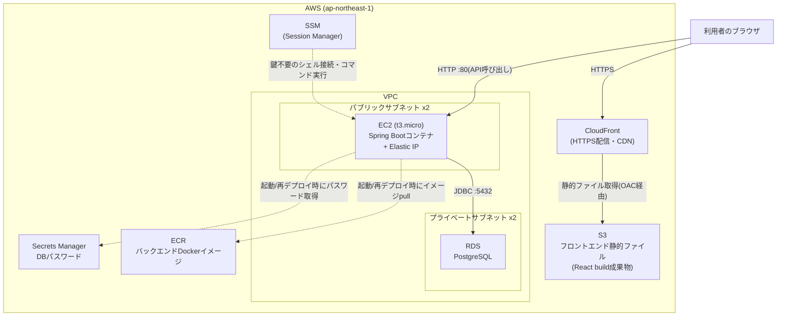

# 03. AWS構成の全体像

## 構成図



## 各リソースの役割

### ネットワーク(`network.tf`, `security_groups.tf`)

- **VPC**: このプロジェクト専用の仮想ネットワーク(`10.0.0.0/16`)
- **パブリックサブネット x2**: 異なるアベイラビリティゾーン(データセンター)に1つずつ配置。バックエンドを動かすEC2インスタンスを置く。インターネットゲートウェイ経由で外部と直接通信できる
- **プライベートサブネット x2**: RDSを置く。外部からの直接アクセス経路を持たない
- **セキュリティグループ**: 通信を許可する範囲を絞るファイアウォール。「EC2は誰からでも80番ポートを受ける」「RDSはEC2からだけ5432番ポートを受ける」という2段構えで、必要最小限の通信だけを許可している

このプロジェクトはコスト削減のため **NATゲートウェイを作らない**。通常はプライベートサブネットのリソースが外部と通信するためにNATゲートウェイ(月額$30程度〜)が必要だが、RDSは自発的に外部と通信しないため不要。EC2インスタンスは代わりにパブリックサブネットに置き、セキュリティグループで受信を絞ることで安全性を確保している(詳細は[00-concepts.md](00-concepts.md)、判断の背景は`network.tf`のコメントを参照)。

### バックエンド実行基盤(`ecr.tf`, `ec2.tf`)

- **ECR**: `backend/Dockerfile` からビルドしたコンテナイメージを保管するプライベートなDockerレジストリ
- **EC2(t3.micro)**: バックエンドコンテナを直接動かす1台のインスタンス。ALBやECSのようなマネージドな実行基盤は使わず、起動時にEC2自身がECRからイメージをpullしてDockerコンテナとして起動する(`terraform/templates/deploy-backend.sh.tpl`)。t3.microはAWSの無料利用枠の対象になりうるインスタンスタイプ
- **Elastic IP**: EC2に紐づく固定のパブリックIPアドレス。インスタンスを再起動してもIPアドレスが変わらない
- **SSM(Systems Manager) Session Manager**: SSHキーを使わずにEC2へシェル接続・コマンド実行できる仕組み。ポート22を一切開けていないため、鍵の管理や紛失のリスクがない

> 元々はALB + ECS Fargateの構成も検討したが、**どちらも無料利用枠の対象外**(常時起動で合計月$25〜30程度)なため、無料利用枠の対象になりうるEC2単一インスタンス構成に変更した。詳細は[05-teardown-and-cost.md](05-teardown-and-cost.md)。

### データベース(`rds.tf`)

- **RDS(PostgreSQL)**: マネージドなPostgreSQL。バックアップ・パッチ適用などをAWSが代行する
- **Secrets Manager**: Terraformが自動生成したDBパスワードを保管する。EC2はこのシークレットのARNを起動スクリプトから参照し、起動時に安全にパスワードを取得する(コードやtfvarsに平文で書かない)

### フロントエンド配信(`s3_cloudfront.tf`)

- **S3**: `npm run build` で生成した静的ファイル(HTML/CSS/JS)を置くだけのストレージ。バケット自体への直接アクセスは許可しない(非公開)
- **CloudFront**: S3の中身を世界中のエッジロケーションにキャッシュして配信するCDN。HTTPS化・高速化を担う。S3へのアクセスは **Origin Access Control(OAC)** という仕組みでCloudFrontからのみ許可している

## リクエストの流れ

1. 利用者がCloudFrontのURL(`https://xxxx.cloudfront.net`)にアクセス → S3上のReactアプリが返る
2. フロントエンドのJavaScriptが、ビルド時に埋め込まれた `VITE_API_BASE_URL`(EC2のElastic IP)へAPIリクエストを送る
3. EC2上のSpring Bootコンテナがリクエストを受ける(ポート80 → コンテナ内部ポート8080へマッピング)
4. Spring BootがRDSのPostgreSQLへ問い合わせて結果を返す

フロントエンド(CloudFrontのオリジン)とバックエンド(EC2のオリジン)は別ドメインになるため、ブラウザからのAPI呼び出しはクロスオリジンリクエストになる。これを許可するため、EC2起動スクリプトが渡す環境変数 `APP_CORS_ALLOWED_ORIGINS` にCloudFrontのURLを設定している(`backend/src/main/resources/application.yml` 参照)。

## トラブルシューティング(SSM接続)

コンテナのログを見たい、起動スクリプトの実行結果を確認したいといった場合は、SSHキーなしでEC2に接続できる。

```powershell
aws ssm start-session --target <ec2_instance_idの値>
```

接続後、以下でログを確認できる。

```bash
sudo cat /var/log/deploy-backend.log   # 起動/再デプロイスクリプトのログ
sudo docker logs backend               # アプリケーションのログ
```

---

構成を理解したら、次は [04-deploy-runbook.md](04-deploy-runbook.md) で実際にデプロイする。
