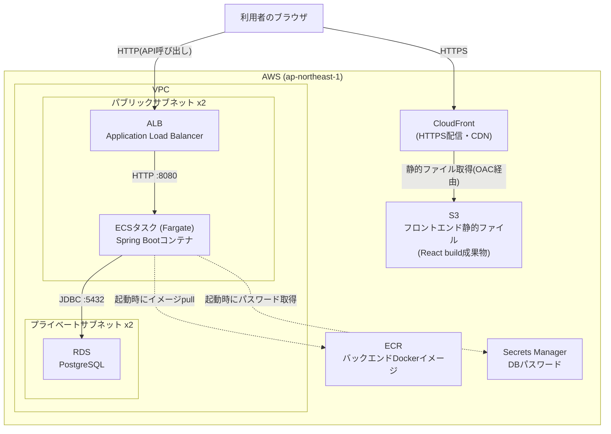

# 03. AWS構成の全体像

## 構成図

## 各リソースの役割

### ネットワーク(`network.tf`, `security_groups.tf`)

- **VPC**: このプロジェクト専用の仮想ネットワーク(`10.0.0.0/16`)
- **パブリックサブネット x2**: 異なるアベイラビリティゾーン(データセンター)に1つずつ配置。ALBとECSタスクを置く。インターネットゲートウェイ経由で外部と直接通信できる
- **プライベートサブネット x2**: RDSを置く。外部からの直接アクセス経路を持たない
- **セキュリティグループ**: 通信を許可する範囲を絞るファイアウォール。「ALBは誰からでも80番ポートを受ける」「ECSはALBからだけ8080番ポートを受ける」「RDSはECSからだけ5432番ポートを受ける」という3段構えで、必要最小限の通信だけを許可している

このプロジェクトはコスト削減のため **NATゲートウェイを作らない**。通常はプライベートサブネットのリソースが外部と通信するためにNATゲートウェイ(月額$30程度〜)が必要だが、RDSは自発的に外部と通信しないため不要。ECSタスクは代わりにパブリックサブネットに置き、セキュリティグループで受信を絞ることで安全性を確保している(詳細は[00-concepts.md](00-concepts.md)、判断の背景は`network.tf`のコメントを参照)。

### バックエンド実行基盤(`ecr.tf`, `ecs.tf`, `alb.tf`)

- **ECR**: `backend/Dockerfile` からビルドしたコンテナイメージを保管するプライベートなDockerレジストリ
- **ECS(Fargate)**: コンテナを動かす実行基盤。「Fargate」はサーバー(EC2インスタンス)を自分で管理せず、コンテナ単位でCPU/メモリを指定して動かせるモード
- **ALB**: インターネットからのHTTPリクエストを受け、ECSタスクへ振り分けるロードバランサー。`/actuator/health`をヘルスチェックし、正常なタスクにのみ通信を流す

### データベース(`rds.tf`)

- **RDS(PostgreSQL)**: マネージドなPostgreSQL。バックアップ・パッチ適用などをAWSが代行する
- **Secrets Manager**: Terraformが自動生成したDBパスワードを保管する。ECSタスク定義はこのシークレットのARNを参照し、起動時に安全にパスワードを取得する(コードやtfvarsに平文で書かない)

### フロントエンド配信(`s3_cloudfront.tf`)

- **S3**: `npm run build` で生成した静的ファイル(HTML/CSS/JS)を置くだけのストレージ。バケット自体への直接アクセスは許可しない(非公開)
- **CloudFront**: S3の中身を世界中のエッジロケーションにキャッシュして配信するCDN。HTTPS化・高速化を担う。S3へのアクセスは **Origin Access Control(OAC)** という仕組みでCloudFrontからのみ許可している

## リクエストの流れ

1. 利用者がCloudFrontのURL(`https://xxxx.cloudfront.net`)にアクセス → S3上のReactアプリが返る
2. フロントエンドのJavaScriptが、ビルド時に埋め込まれた `VITE_API_BASE_URL`(ALBのURL)へAPIリクエストを送る
3. ALBがリクエストをECS上のSpring Bootコンテナへ転送
4. Spring BootがRDSのPostgreSQLへ問い合わせて結果を返す

フロントエンド(CloudFrontのオリジン)とバックエンド(ALBのオリジン)は別ドメインになるため、ブラウザからのAPI呼び出しはクロスオリジンリクエストになる。これを許可するため、ECSタスクの環境変数 `APP_CORS_ALLOWED_ORIGINS` にCloudFrontのURLを設定している(`backend/src/main/resources/application.yml` 参照)。

---

構成を理解したら、次は [04-deploy-runbook.md](04-deploy-runbook.md) で実際にデプロイする。
